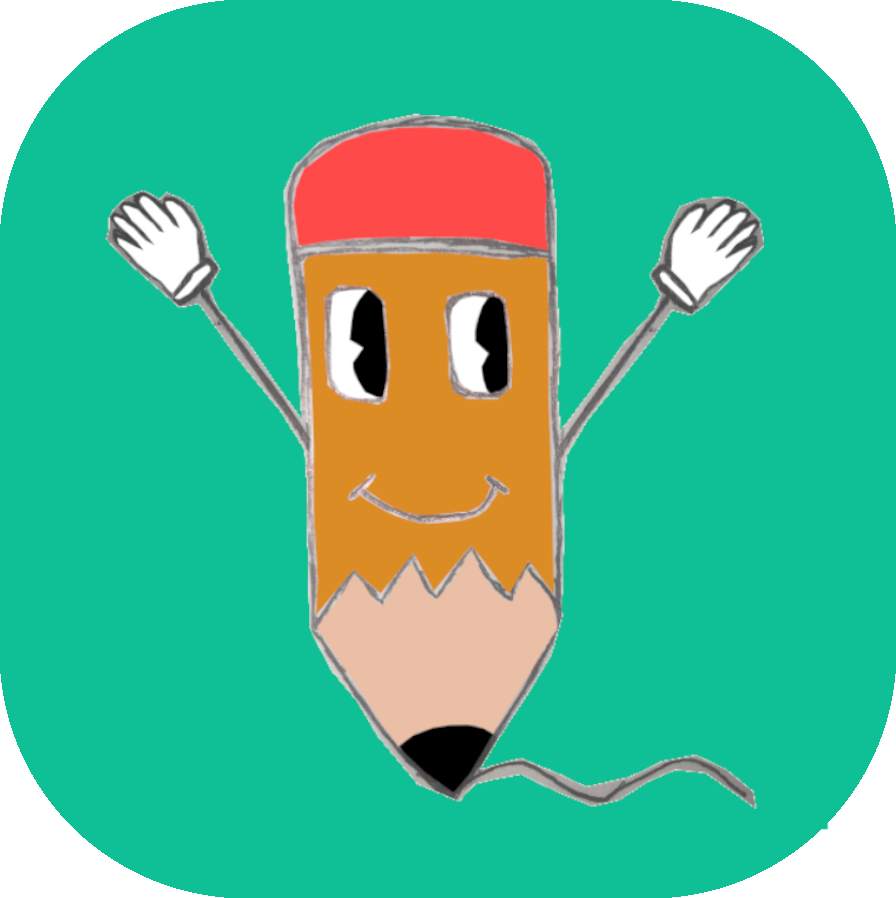
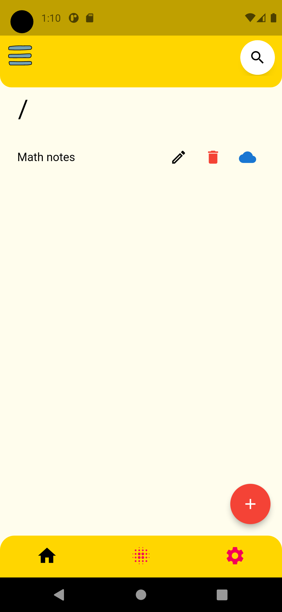
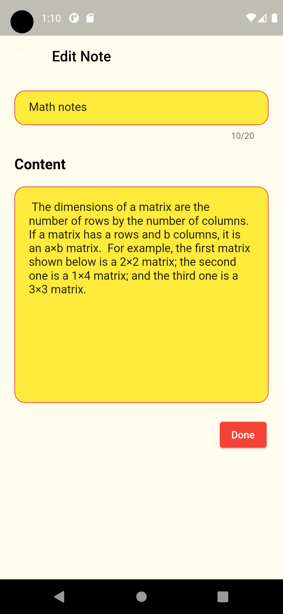
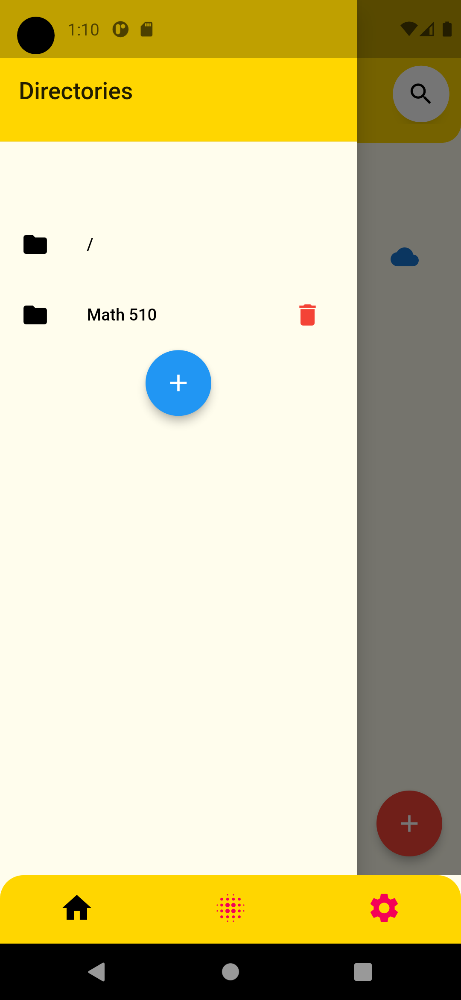
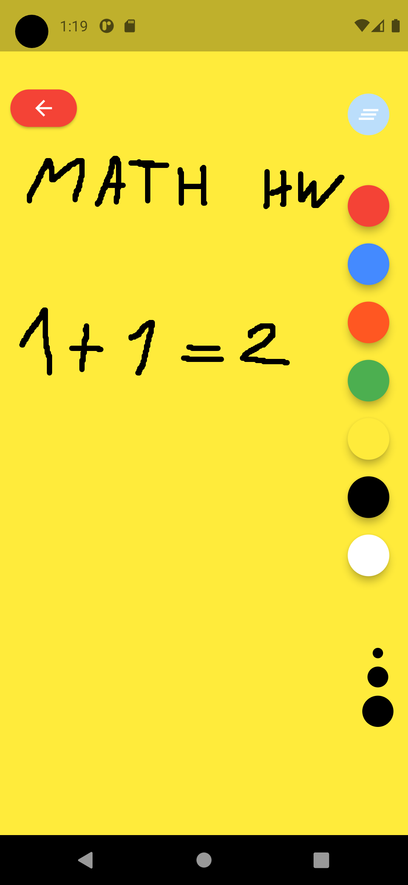
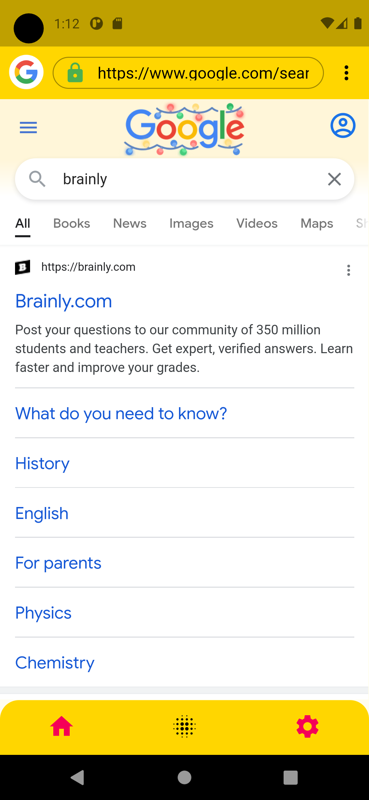
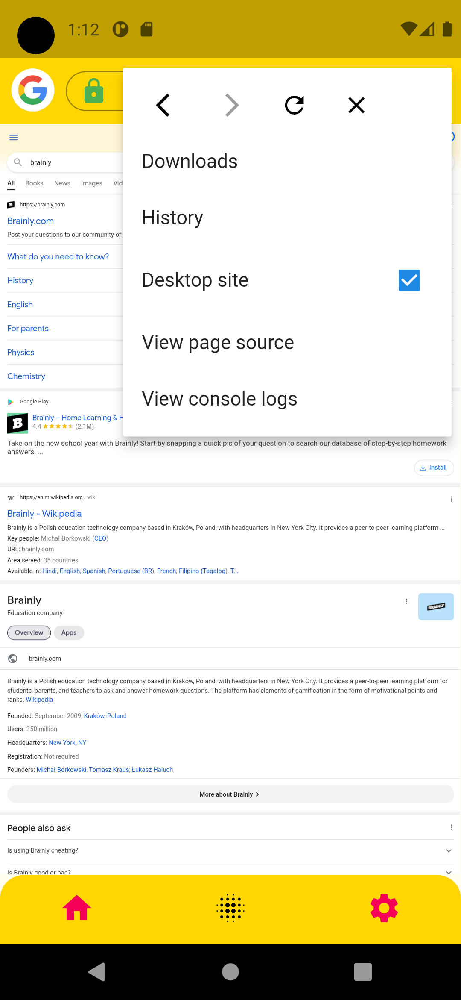
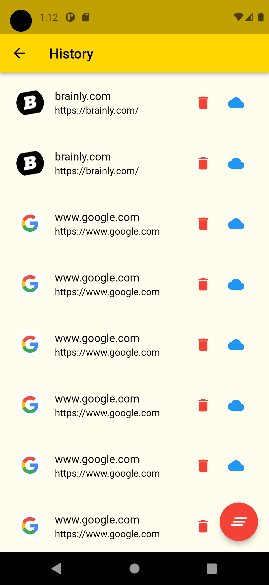
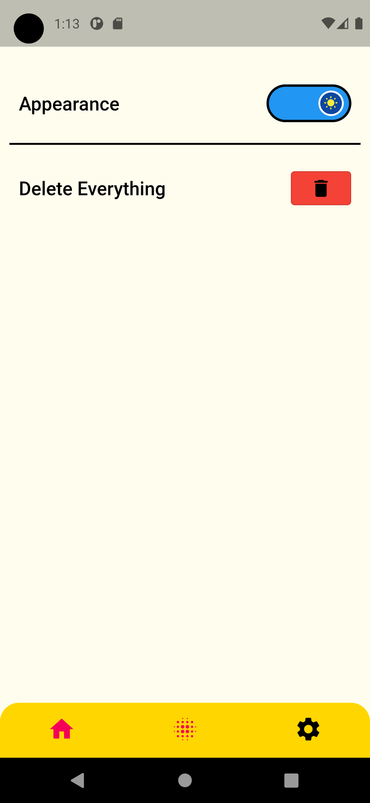
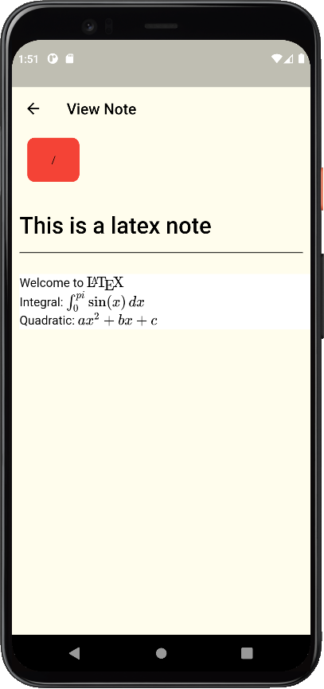

<p align="center"></p>

<h2 align="center"><b>Forever Note</b></h2>

<h4 align="center">An Android and IOS note taking app made with flutter.</h4>

<hr/>

## Getting Started

These instructions will get you a copy of the project up and running on your local computer for development and testing purposes.

## Using Flutter SDK

### Cloning

```command
git clone https://github.com/riimuru/ForeverNoteV1
cd ForeverNoteV1
```

### Installing

Install the packages and run the app.

```command
flutter pub get
flutter run
```

## Docker

TODO

# App Walkthrough

## Screenshots

[](assets/screenshots/Screenshot1_light.png)
[](assets/screenshots/Screenshot2_light.png)
[](assets/screenshots/Screenshot3_light.png)
[](assets/screenshots/Screenshot3.png)
[](assets/screenshots/Screenshot4_light.png)
[](assets/screenshots/Screenshot5_light.png)
[](assets/screenshots/Screenshot6_light.png)
[](assets/screenshots/Screenshot7_light.png)
[](assets/screenshots/Screenshot_Latex.png)

## Features

- Create notes
- Sketch/Draw
- LaTeX
- Search In Browser
- Dark Mode Support

## Technologies used

- [Flutter](https://docs.flutter.dev/)
- [Dart](https://dart.dev/)
- [http](https://dart.dev/http)
- [flutter_tex](https://pub.dev/packages/flutter_tex)
- [flutter_inappwebview](https://pub.dev/packages/flutter_inappwebview)
- [flutter_downloader](https://pub.dev/packages/flutter_downloader)
- [flutter_lints](https://pub.dev/packages/flutter_lints)
- [anim_search_bar](https://pub.dev/packages/anim_search_bar)
- [flutter_svg](https://pub.dev/packages/flutter_svg)
- [permission_handler](https://pub.dev/packages/permission_handler)
- [flutter_svg](https://pub.dev/packages/flutter_svg)
- [sqflite](https://pub.dev/packages/sqflite)
- [provider](https://pub.dev/packages/provider)
- [path_provider](https://pub.dev/packages/path_provider)
- [path](https://pub.dev/packages/path)
- [shared_preferences](https://pub.dev/packages/shared_preferences)
- [flutter_switch](https://pub.dev/packages/flutter_switch)
- [flutter_native_splash](https://pub.dev/packages/flutter_native_splash)
